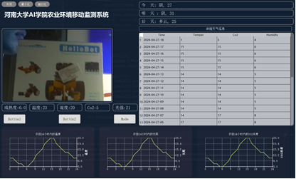
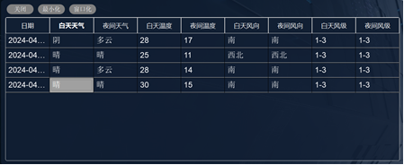
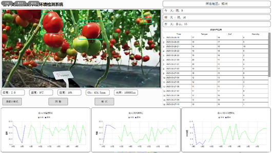

# open_program

一个基于 PyQt5 的农业环境监测桌面程序，集成了视频画面展示、YOLO 目标检测、天气信息查询、历史环境数据记录以及折线图展示等功能。


 
在农业环境监测系统的Dark模式下调用树莓派摄像头


天气预报详细信息界面


农业环境监测系统前端显示界面

## 功能概览

- 实时显示主界面与摄像头/视频画面
- 基于 YOLOv4-tiny 的目标检测
- 获取所在城市的实时天气和未来天气
- 查看详细天气信息表格
- 记录并查询历史环境数据
- 通过折线图展示温度、光照和 CO2 浓度变化
- 支持暗色/亮色界面风格切换

## 运行环境

- Python 3.8+ 建议
- Windows
- 需要联网访问高德地图天气接口

## 依赖安装

项目当前未单独提供 `requirements.txt`，可先安装这些常用依赖：

```bash
pip install PyQt5 PyQtChart opencv-python numpy requests
```

如果你的环境里已经包含这些包，可以直接跳过。

## 启动方式

在项目根目录下运行主程序：

```bash
python UI_test_5.py
```

如果你使用的是本项目自带的虚拟环境，可以先激活后再运行：

```powershell
.\pythonProject\Scripts\Activate.ps1
python UI_test_5.py
```

## 说明

- 主入口文件是 `UI_test_5.py`
- 天气接口逻辑在 `weather.py`
- 历史数据读写逻辑在 `history_data.py`
- 详细天气窗口在 `detail_weather_info.py`
- 图表组件在 `LineChart.py`、`LineChart_1.py`、`LineChart_yu.py`
- YOLO 模型文件 `custom-yolov4-tiny-detector_best.weights` 和 `custom-yolov4-tiny-detector.cfg` 需要保留在项目根目录
- `history_data/` 目录用于保存按日期组织的历史数据文本文件
- `weather.py` 中的高德 API Key 目前是写死的，若接口不可用，需要改成你自己的 Key

## 项目结构

```text
open_program/
├── UI_test_5.py
├── weather.py
├── CO2_light.py
├── detail_weather_info.py
├── history_data.py
├── LineChart.py
├── LineChart_1.py
├── LineChart_yu.py
├── custom-yolov4-tiny-detector_best.weights
├── custom-yolov4-tiny-detector.cfg
├── history_data/
└── weather/
```
